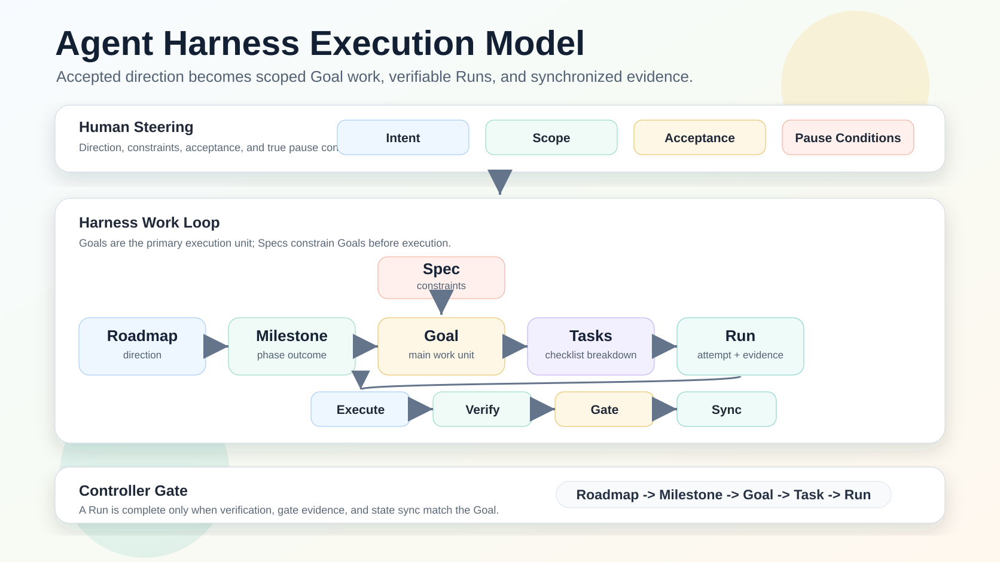
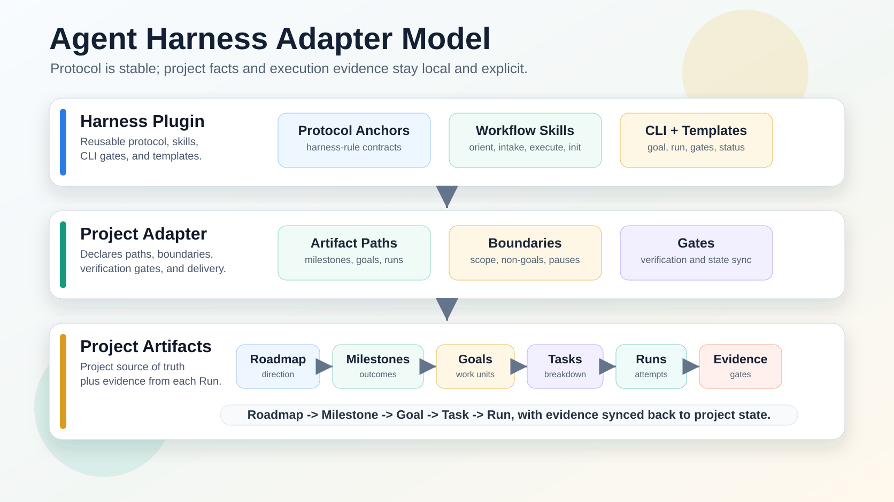

# Agent Harness

[简体中文](README.md)

[](CHANGELOG.md)
[](plugins/agent-harness/.codex-plugin/plugin.json)
[](LICENSE)

Agent Harness is an adapter-driven control plane for coding-agent work.
It turns accepted direction into scoped execution, verifiable evidence,
and synchronized project state—without making the human route every task.
Codex is the first host pack, not the only runtime.

```text
Roadmap -> Milestone -> Goal -> Task -> Run -> Evidence -> State Sync
```

[Quick Start](#use-with-a-coding-agent) · [How It Works](#how-it-works) ·
[Architecture](#architecture) · [Safety](#safety-and-acceptance) ·
[Documentation](#documentation)

## Use With A Coding Agent

### 1. Adopt the project with the CLI

```bash
node plugins/agent-harness/scripts/agent-harness.mjs init --cwd <project> --contract adapter
node plugins/agent-harness/scripts/agent-harness.mjs skills install --cwd <project>
node plugins/agent-harness/scripts/agent-harness.mjs doctor --cwd <project>
```

Skills install into the downstream project's `.agents/skills/` directory. That
is the cross-client discovery convention, not every host's only path. See
[Install](docs/install.md).

### 2. Ask the current host to use Harness

Most users do not need to name a skill or run the CLI directly:

```text
Use harness to check the next step in this project.
Use harness to record this idea, but do not implement it yet: Add an import flow.
Use harness to execute harness/goals/YYYY-MM-DD-task-title.md, verify it, and sync state.
Use the current session as controller and carry the accepted spec through to completion; keep the outcome in the runtime outcome and current steps in the transient plan.
```

### 3. Optional Codex marketplace

Codex users can still install `harness` from the Plugins Directory
(`agent-harness-local`). Register the local marketplace first:

```bash
codex plugin marketplace add <path-to-agent-harness-repo>
```

This registers marketplace metadata from the checkout; it does not install the plugin.

### 4. Choose an explicit entry when needed

| Situation | Public skill |
| --- | --- |
| Adopt Harness, import an existing Goal index, run doctor, or preview activation. | `harness:init` |
| Inspect status, blockers, stale artifacts, or the next route without mutation. | `harness:orient` |
| Capture or triage an idea, requirement, bug, or inbox note; adapters can record unaccepted candidates through `paths.ideaInbox`. | `harness:intake` |
| Control durable work, or sync existing Harness state after the current host completes simple work. | `harness:execute` |

Ordinary clear change/build requests use the current host directly. Clarifying scope,
asking a question, and creating a repository Goal are actions rather than extra routes;
proposal competition is an explicitly chosen advanced read-only technique.

Harness uses three execution paths:

- `host-direct`: ordinary work stays entirely in the current host and creates no Harness lifecycle.
- `host-direct-postflight`: after the host completes simple work, verify and update only Task, Goal, or status state that already existed before execution.
- `durable-harness`: cross-task recovery, audit, milestone/DAG, multi-worker, persistent state sync, or high-risk work uses a repository Goal/Run.

Long-running controller work should use a runtime outcome for the current
result and a transient plan for short-lived steps. Harness does not mirror every plan
transition; it records project facts at durable boundaries or postflight closeout.

These runtime capabilities are optional and are detected from the current host,
not inferred from a model name. Older models or smaller runtimes fall back to
the current thread and a short checklist; the CLI still validates paths,
evidence, gates, and accepted state.

## Why Agent Harness

Agent Harness is for the moment after the human has set direction. The human
still owns product judgment, authorization, and true pause conditions. Harness
owns the repeatable execution mechanics inside the project adapter:

- discover roadmap, milestone, spec, Goal, Task, and Run state;
- turn a request such as `complete M5` into explicit completion items;
- prepare Goals and execution DAGs instead of stopping at the next small spec;
- record worker ownership, DAG state, and candidate evidence while the host schedules work;
- bind prepared Runs to a Goal/Spec/DAG manifest and protect state with atomic concurrent recording;
- give explicitly `enforced` managed Runs an independent revision-safe
  `checkpoint.json`; contract drift and uncertain external state fail closed,
  while default-disabled Runs and fast paths gain no ceremony;
- verify concrete evidence before accepting Task/Goal completion;
- require `State Sync Notes` as part of Goal and Task completion;
- keep Goal indexes, bounded status snapshots, Goals, Runs, and gates aligned;
- inspect and archive active control state through a dry-run-first artifact
  lifecycle, and prune local-only Runs only after durable sync and explicit action;
- pause for real human gates such as unclear direction, credentials, paid APIs,
  production access, destructive actions, or external side effects outside
  accepted scope.
- keep status-only legacy Runs inspectable but `unmanaged`, so they cannot
  automatically complete Tasks or be pruned.

The promise is not merely that agents write files. The promise is that coding
agents stop losing the plot between roadmap, specification, implementation,
verification, state sync, and handoff.

## How It Works



The user-facing hierarchy is:

```text
Roadmap -> Milestone -> Goal -> Task -> Run
```

- A **Roadmap** carries longer-range direction.
- A **Milestone** is a phase-level outcome and may require several Goals.
- A **Goal** is the primary Harness work unit with scope and acceptance.
- A **Task** is a concrete checklist or execution item inside a Goal.
- A **Run** is one execution attempt and evidence record, not a thread.
- A **Spec** constrains the Goal before execution; it is not a post-Run artifact.

### Spec and PRD

Agent Harness does not define PRD as a separate protocol concept. A Product
Requirements Document usually explains the user problem, product value, and
desired outcome; it can be one source for a Harness Spec.

`Spec` is the broader execution term. It means accepted scope that makes the
Goal's boundaries, constraints, and acceptance conditions clear. A PRD may
satisfy that need, may need technical or operational supplements, or may be
irrelevant to non-product work. Harness therefore does not require a PRD and
does not add PRD-specific paths, config, lifecycle state, or gates.

Parent milestones stay open until their mapped items are satisfied. Accepting a
source-spec item such as `M5-S0` cannot silently close the parent `M5` while
implementation work remains.

Canonical domain invariants bound durable control: configured path containment,
Run/DAG ownership, candidate-versus-accepted evidence, authoritative
completion, and state sync. Ordinary clear change/build uses Codex directly; existing
simple state gets postflight sync only; recovery, audit, milestone/DAG,
multi-worker, persistent state-sync, or high-risk work crosses the
`harness-rule:durable-tier-boundary`. See the
[Capability Matrix](docs/HARNESSES.md).

## Architecture



Agent Harness separates stable protocol from local project facts:

```text
Plugin defines protocol. Adapter defines overrides. Artifacts record facts.
```

- The **plugin** ships workflow skills, protocol references, schemas,
  templates, and deterministic CLI gates.
- The **project adapter** declares artifact paths, boundaries, verification,
  state-sync rules, work mode, and external-action policy.
- The **project artifacts** record the roadmap, milestones, specs, Goals,
  Tasks, Runs, gate results, and evidence.

Adapter projects resolve artifact paths through `.harness/config.json`; plugin
core does not embed downstream product names, ports, credentials, database
rules, or production policy. The detailed path map lives in the
[Project Contract](docs/project-contract.md#adapter-contract).

### Adapter language policy

The project adapter owns the machine-readable language preference:

```json
{
  "language": {
    "default": "zh-CN"
  }
}
```

Supported values are `auto`, `en`, and `zh-CN`. CLI language selection uses
this precedence: `--lang`, `AGENT_HARNESS_LANG`, `language.default`, `LC_ALL`,
`LC_MESSAGES`, then `LANG`; unresolved `auto` falls back to English.

Current boundary: this setting localizes supported human-facing CLI messages.
Deterministic artifacts created by `init`, `goal create`, and `run prepare`
still use the English base templates and renderers. Agent responses should
follow the user's language while preserving code, commands, paths, API names,
skill names, model names, and Git commit messages in their original form. See
[Install In Codex](docs/install.md#language-policy) and the
[Project Contract](docs/project-contract.md#adapter-language-policy).

### Commentary policy

Projects can reduce redundant progress narration without hiding material
signals:

```json
{
  "communication": {
    "commentary": "minimal"
  }
}
```

Supported values are `minimal`, `balanced`, and `audit`; omitted configuration
defaults to `minimal`. The policy shapes Harness skill and generated-run
guidance. It does not filter Codex messages or override host-required tool,
safety, approval, or heartbeat updates. See the
[Project Contract](docs/project-contract.md#commentary-policy).

## Safety And Acceptance

Harness treats worker, automation, inbox, and proposal output as candidate
evidence until the control lane validates it. Completion requires concrete,
inspectable evidence such as changed files, command summaries, Run records,
gate records, or human review notes.

Key boundaries:

- A controller is the outcome owner and accepted-state owner. Foreground
  implementation is prohibited only when the user or Goal explicitly says
  `gate-only` or review-only.
- Resolve work mode before thread creation, handoff, or delegation. An
  unresolved `ask` result or authority conflict pauses for the user; thread
  authority alone does not authorize a worktree.
- Parallel writers require separate locked worktrees/cwds or recorded proof of
  non-overlapping ownership; the host owns scheduling and concurrency.
- Task/Goal is the accepted-state authority; Run retains evidence and status
  remains a bounded projection.
- `harness-rule:durable-tier-boundary` sends ordinary clear change/build to
  Codex, limits existing simple state to postflight sync, and reserves Harness
  ceremony for persistent control needs.
- Status files are bounded current-state snapshots, not append-only history.
- Newer conversation-confirmed direction is reconciled with stale artifacts
  before execution continues.
- Conditional plugin bootstrap is not enabled, so installed Harness skills do
  not inject instructions into unrelated projects.

The complete runtime surfaces, protocol anchors, and verification suites are in
the [Capability Matrix](docs/HARNESSES.md).

## Repository And Validation

This repository is both the Agent Harness source project and a Codex local
marketplace:

- `.agents/plugins/marketplace.json` exposes the local plugin.
- `plugins/agent-harness/` contains the installable plugin.
- `plugins/agent-harness/skills/` contains the four public workflow skills.
- `plugins/agent-harness/references/` contains canonical protocols.
- `plugins/agent-harness/schemas/` and `templates/` define project contracts.
- `plugins/agent-harness/scripts/agent-harness.mjs` provides deterministic CLI
  operations for agents and maintainers.
- `evals/` contains project-neutral evaluation fixtures.

The repository's own `harness/` and `.harness/` directories are development
state for this project. They are not installed as plugin content. Downstream
projects receive their own adapter artifacts only through adoption or import.

For README, documentation, or plugin-surface changes, run:

```bash
git diff --check
npm run test:all
npm run validate:plugin
```

The CLI remains deterministic tooling rather than the primary first-use path.
See the [CLI reference](docs/cli.md) for its command surface.

## Evaluation

The deterministic suite under [`evals/`](evals/) validates fixtures and trace
contracts; it does not run a model or prove GPT-6 Astra activation. The separately
authorized `npm run test:eval:live` lane uses ephemeral read-only Codex
execution and requires runtime-reported model evidence.

Project-neutral adoption examples cover new projects, existing adapter imports,
fixed-contract compatibility, non-Harness projects, and messy realistic states:
[Downstream Project Shapes](docs/examples/downstream-project-shapes.md).

## Documentation

- [Usage](docs/usage.md)
- [Install](docs/install.md)
- [CLI Reference](docs/cli.md)
- [Capability Matrix](docs/HARNESSES.md)
- [Project Contract](docs/project-contract.md)
- [Cybernetic Stability](docs/cybernetic-stability.md)
- [GitHub Presentation](docs/github-presentation.md)
- [v0.11.0 Release Preparation Notes](docs/releases/v0.11.0.md)
- [Changelog](CHANGELOG.md)

Agent Harness is inspired in part by b3ehive's controller-led approach, while
keeping its own fixed/adapter contracts and project-neutral core.

## Roadmap

The protocol, CLI, and four skills now speak in host capabilities. Codex is
the first host pack; the Cursor capability and result-packet map lives in
`plugins/agent-harness/hosts/cursor/`. Do not describe this repository as
fully multi-agent until a second host has walked `host-direct`,
`host-direct-postflight`, and `durable-harness` with inspectable evidence.
When those capabilities are missing, Harness should fall back to
bounded foreground execution rather than pretend parallelism or isolation.
