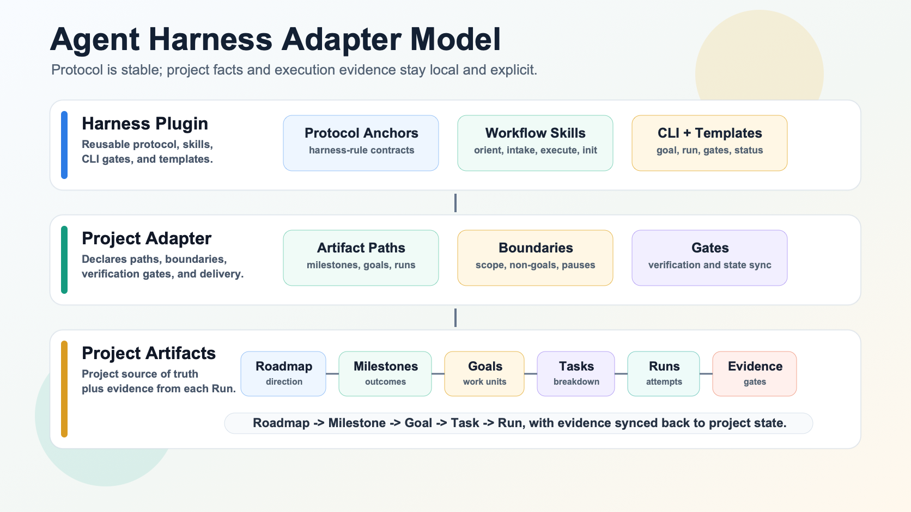
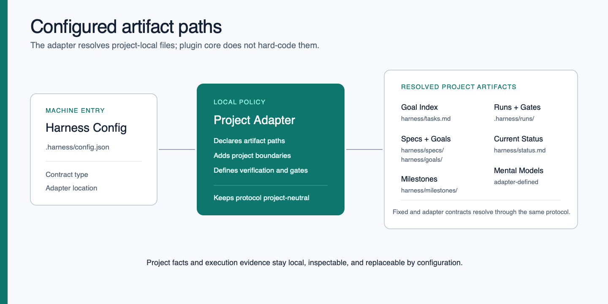
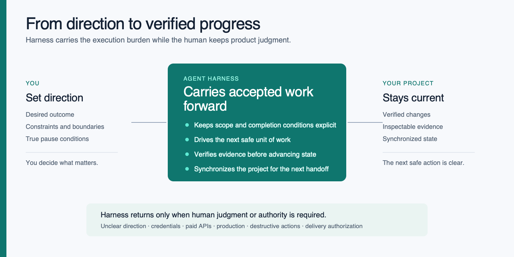

# Agent Harness

[中文](README.zh-CN.md)

Agent Harness is a reusable Codex workflow package for development projects.
It standardizes the small control plane that every project needs before goal
automation and loop engineering can work reliably.

## Problem

When one person operates many software projects, each project tends to invent
its own backlog file, status notes, branch habits, and goal prompts. That makes
automation brittle. Codex cannot safely decide what to do next if it has to
rediscover each project's task system from scratch.

## Adapter Model

Agent Harness is an adapter-driven workflow. The plugin provides the stable
protocol, each project keeps a thin adapter, and project artifacts record the
actual task, spec, goal, run, and gate facts.

The adapter contract is a project execution model, not a single file. It
connects task intake, roadmap direction, milestone planning, specs, goals,
runs, gates, and evidence.

The core principle is:

```text
Plugin defines protocol. Adapter defines overrides. Artifacts record facts.
```



## Artifact Map

Adapter projects use `.harness/config.json` plus a project adapter to
resolve artifact paths. The plugin does not need to know project-specific
product names, database boundaries, production rules, ports, credentials, or
release policy.

Typical adapter artifacts include:

- `Task Index`: the active task/backlog source of truth.
- `Roadmap`: longer-range product or engineering direction.
- `Milestones`: phase-level task DAGs, gates, and deferred registers.
- `Specs`: accepted scope, non-goals, decisions, and validation.
- `Goals`: executable handoff prompts.
- `Runs / Logs`: one execution attempt, status, prompt, subagent guidance, and
  evidence.
- `Gate Records`: review, integration, acceptance, and state-sync decisions.



## Package Shape

This repo is both a source project and a Codex local marketplace:

- `.agents/plugins/marketplace.json` exposes the local plugin.
- `plugins/agent-harness/` contains the installable Codex plugin.
- `plugins/agent-harness/skills/` contains reusable Codex skills.
- `plugins/agent-harness/references/` contains canonical harness protocols.
- `plugins/agent-harness/templates/` contains starter templates.
- `plugins/agent-harness/scripts/agent-harness.mjs` provides a small CLI.

## First Commands

Validate the plugin:

```bash
npm run validate:plugin
npm run test:smoke
```

Initialize an adapter-contract downstream project:

```bash
node plugins/agent-harness/scripts/agent-harness.mjs init --cwd /path/to/project --contract adapter
```

Import an existing adapter project that already has an adapter and task
index, without creating a second task index:

```bash
node plugins/agent-harness/scripts/agent-harness.mjs config import --cwd /path/to/project --task-index todolist.md --dry-run
node plugins/agent-harness/scripts/agent-harness.mjs config import --cwd /path/to/project --task-index todolist.md
```

If a project already has `todolist.md`, `init --contract adapter` preserves it
instead of creating a parallel `harness/tasks.md`. A real `config import` writes the
machine config and creates missing support artifacts such as the configured
status file and runs directory.

Check a downstream project:

```bash
node plugins/agent-harness/scripts/agent-harness.mjs doctor --cwd /path/to/project
```

Inspect resolved config and adapter paths:

```bash
node plugins/agent-harness/scripts/agent-harness.mjs config inspect --cwd /path/to/project --json
node plugins/agent-harness/scripts/agent-harness.mjs adapter inspect --cwd /path/to/project --json
```

Recommend whether to use the current checkout, a worktree, or ask first:

```bash
node plugins/agent-harness/scripts/agent-harness.mjs worktree recommend --cwd /path/to/project
node plugins/agent-harness/scripts/agent-harness.mjs worktree recommend --cwd /path/to/project --json
```

Use Chinese command output:

```bash
node plugins/agent-harness/scripts/agent-harness.mjs doctor --cwd /path/to/project --lang zh-CN
```

Create a goal handoff from the configured task index:

```bash
node plugins/agent-harness/scripts/agent-harness.mjs goal create --cwd /path/to/project --task "Task title"
```

The adapter contract requires an accepted spec:

```bash
node plugins/agent-harness/scripts/agent-harness.mjs goal create --cwd /path/to/project --task "Task title" --spec harness/specs/task-title.md
```

Prepare a run packet from a goal:

```bash
node plugins/agent-harness/scripts/agent-harness.mjs run prepare --cwd /path/to/project --goal harness/goals/YYYY-MM-DD-task-title.md
```

Inspect a prepared run:

```bash
node plugins/agent-harness/scripts/agent-harness.mjs run status --cwd /path/to/project --run .harness/runs/YYYYMMDD-HHMMSS-task-title
```

## Workflow

Human steering sets direction. Harness owns the execution engine inside the
adapter boundaries, and it escalates back to a human gate when review,
approval, credentials, production access, or unblocking decisions are needed.



The intended adapter workflow is:

```text
init/import -> task index -> goal create -> worktree recommend -> run prepare -> execute -> verify -> update state records
```

`goal create` writes a durable handoff under the configured goals directory.
`run prepare` writes `run.md`, `prompt.md`, `subagents.md`, `status.json`, and
`logs/` under the configured runs directory. It does not start Codex, create a
daemon, push, deploy, or open a PR.

## Command Language

Human-facing CLI output supports `en` and `zh-CN` for `init`, `doctor`, and
`worktree recommend`, and help/usage. The language is resolved in this order:

1. `--lang <code>`
2. `AGENT_HARNESS_LANG`
3. `.harness/config.json` `language.default`
4. system locale from `LC_ALL`, `LC_MESSAGES`, or `LANG`
5. fallback `en`

Use `auto` to continue to the next source. Unknown language codes fall back to
`en`. Machine output, JSON from `print-contract`, paths, command names, package
names, skill names, and Git output remain unchanged.

## Install In Codex

During local development, add this repo as a marketplace root:

```bash
codex plugin marketplace add <path-to-agent-harness-repo>
```

After publishing this repo to GitHub, install it on another machine with:

```bash
codex plugin marketplace add <owner>/<repo>
```

Codex will read `.agents/plugins/marketplace.json` and expose the
`agent-harness` plugin.

## Current Design Bias

The current version is intentionally bounded:

- It creates stable files and directories.
- It gives Codex a consistent way to find project task, spec, goal, and run
  artifacts.
- It recommends worktree behavior, but does not force branch creation.
- It starts with report-only loops before unattended fix loops.
- It makes escalation points explicit before credentials, paid APIs,
  production access, destructive operations, push, PR, deploy, or release.

The goal is to make Codex more predictable before making it more autonomous.
