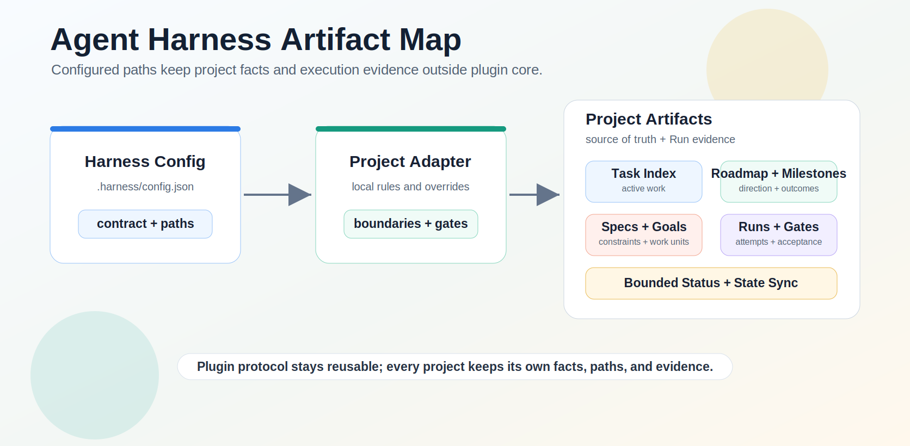

# Agent Harness

[简体中文](README.zh-CN.md)

[](CHANGELOG.md)
[](plugins/agent-harness/.codex-plugin/plugin.json)
[](LICENSE)

Agent Harness is an adapter-driven control plane for Codex and coding-agent
work. It turns accepted direction into scoped execution, verifiable evidence,
and synchronized project state—without making the human route every task.

```text
Roadmap -> Milestone -> Goal -> Task -> Run -> Evidence -> State Sync
```

[Quick Start](#use-with-a-coding-agent) · [How It Works](#how-it-works) ·
[Architecture](#architecture) · [Safety](#safety-and-acceptance) ·
[Documentation](#documentation)

## Use With A Coding Agent

### 1. Install the plugin

From a local checkout:

```bash
codex plugin marketplace add <path-to-agent-harness-repo>
```

From GitHub:

```bash
codex plugin marketplace add <owner>/<repo>
```

Codex reads `.agents/plugins/marketplace.json` and exposes the plugin as
`harness`. See [Install In Codex](docs/install.md) for updates, activation, and
project-adoption details.

### 2. Ask Codex to use Harness

Most users do not need to name a skill or run the CLI directly:

```text
Use harness to check the next step in this project.
Use harness to record this idea, but do not implement it yet: Add an import flow.
Use harness to execute harness/goals/YYYY-MM-DD-task-title.md, verify it, and sync state.
Use the current thread as controller and carry the accepted spec through to completion.
```

### 3. Choose an explicit entry when needed

| Situation | Public skill |
| --- | --- |
| Adopt Harness, import an existing task index, run doctor, or preview activation. | `harness:init` |
| Inspect status, blockers, stale artifacts, or the next route without mutation. | `harness:orient` |
| Capture or triage an idea, requirement, bug, or inbox note. | `harness:intake` |
| Prepare a Goal from accepted scope, execute confirmed work, verify, and sync state. | `harness:execute` |

`shape`, `goal`, `competition`, and `ask` are internal route states, not
additional installed skills. Harness maps them back to one of the public skills
or to an exact user decision.

## Why Agent Harness

Agent Harness is for the moment after the human has set direction. The human
still owns product judgment, authorization, and true pause conditions. Harness
owns the repeatable execution mechanics inside the project adapter:

- discover roadmap, milestone, spec, Goal, Task, and Run state;
- turn a request such as `complete M5` into explicit completion items;
- prepare Goals and execution DAGs instead of stopping at the next small spec;
- coordinate workers without confusing candidate output with accepted state;
- verify concrete evidence before advancing delivery state;
- require `State Sync Notes` as part of Task completion;
- keep task indexes, bounded status snapshots, Goals, Runs, and gates aligned;
- pause for real human gates such as unclear direction, credentials, paid APIs,
  production access, destructive actions, or delivery above policy.

The promise is not merely that agents write files. The promise is that coding
agents stop losing the plot between roadmap, specification, implementation,
verification, delivery, and handoff.

## How It Works


The user-facing hierarchy is:

```text
Roadmap -> Milestone -> Goal -> Task -> Run
```

- A **Roadmap** carries longer-range direction.
- A **Milestone** is a phase-level outcome and may require several Goals.
- A **Goal** is the primary Harness work unit with scope and acceptance.
- A **Task** is a concrete checklist or execution item inside a Goal.
- A **Run** is one execution attempt and evidence record, not a thread.
- A **Spec** constrains the Goal before execution; it is not a post-Run artifact.

Parent milestones stay open until their mapped items are satisfied. Accepting a
source-spec item such as `M5-S0` cannot silently close the parent `M5` while
implementation work remains.

`harness-rule:cybernetic-stability` keeps the loop explicit: intent selects the
target, fresh observations form a measurement snapshot, the controller acts on
the remaining gap, and verification determines whether the loop should
continue, pause, ask, or close. See
[Cybernetic Stability](docs/cybernetic-stability.md).

## Architecture


Agent Harness separates stable protocol from local project facts:

```text
Plugin defines protocol. Adapter defines overrides. Artifacts record facts.
```

- The **plugin** ships workflow skills, protocol references, schemas,
  templates, and deterministic CLI gates.
- The **project adapter** declares artifact paths, boundaries, verification,
  state-sync rules, work mode, and delivery policy.
- The **project artifacts** record the roadmap, milestones, specs, Goals,
  Tasks, Runs, gate results, and evidence.



Adapter projects resolve these paths through `.harness/config.json`; plugin core
does not embed downstream product names, ports, credentials, database rules, or
production policy.

## Safety And Acceptance

Harness treats worker, automation, inbox, and proposal output as candidate
evidence until the control lane validates it. Completion requires concrete,
inspectable evidence such as changed files, command summaries, Run records,
gate records, or human review notes.

Key boundaries:

- `gate-only` controllers review and accept evidence without editing candidate
  implementation directly.
- Parallel writers require separate locked worktrees/cwds or recorded proof of
  non-overlapping ownership; execution is sequential by default.
- Local verification does not imply commit, push, review, integration, release,
  or deployment.
- Status files are bounded current-state snapshots, not append-only history.
- Newer conversation-confirmed direction is reconciled with stale artifacts
  before execution continues.
- Conditional plugin bootstrap is not enabled, so installed Harness skills do
  not inject instructions into unrelated projects.

The complete runtime surfaces, protocol anchors, and verification suites are in
the [Capability Matrix](docs/HARNESSES.md).

## Repository And Validation

This repository is both the Agent Harness source project and a Codex local
marketplace:

- `.agents/plugins/marketplace.json` exposes the local plugin.
- `plugins/agent-harness/` contains the installable plugin.
- `plugins/agent-harness/skills/` contains the four public workflow skills.
- `plugins/agent-harness/references/` contains canonical protocols.
- `plugins/agent-harness/schemas/` and `templates/` define project contracts.
- `plugins/agent-harness/scripts/agent-harness.mjs` provides deterministic CLI
  operations for agents and maintainers.
- `evals/` contains project-neutral evaluation fixtures.

The repository's own `harness/` and `.harness/` directories are development
state for this project. They are not installed as plugin content. Downstream
projects receive their own adapter artifacts only through adoption or import.

For README, documentation, or plugin-surface changes, run:

```bash
git diff --check
npm run test:presentation
npm run test:protocol
npm run test:smoke
npm run validate:plugin
```

The CLI remains deterministic tooling rather than the primary first-use path.
See the [CLI reference](docs/cli.md) for its command surface.

## Evaluation

The deterministic suite under [`evals/`](evals/) validates fixtures and trace
contracts; it does not run a model or prove GPT-5.6 activation. The separately
authorized `npm run test:eval:live` lane uses ephemeral read-only Codex
execution and requires runtime-reported model evidence.

Project-neutral adoption examples cover new projects, existing adapter imports,
fixed-contract compatibility, non-Harness projects, and messy realistic states:
[Downstream Project Shapes](docs/examples/downstream-project-shapes.md).

## Documentation

- [Usage](docs/usage.md)
- [Install In Codex](docs/install.md)
- [CLI Reference](docs/cli.md)
- [Capability Matrix](docs/HARNESSES.md)
- [Project Contract](docs/project-contract.md)
- [Cybernetic Stability](docs/cybernetic-stability.md)
- [GitHub Presentation](docs/github-presentation.md)
- [v0.6.0 Release Notes](docs/releases/v0.6.0.md)
- [Changelog](CHANGELOG.md)

Agent Harness is inspired in part by b3ehive's controller-led approach, while
keeping its own fixed/adapter contracts and project-neutral core.

## Roadmap

The next direction is an agent-neutral adapter layer that other coding agents
can implement without weakening Harness contracts. New execution surfaces
should be added only when they can declare isolation, return inspectable result
packets, report verification and state-sync evidence, and respect delivery
boundaries. When those capabilities are missing, Harness should fall back to
bounded foreground execution rather than pretend parallelism or isolation.
