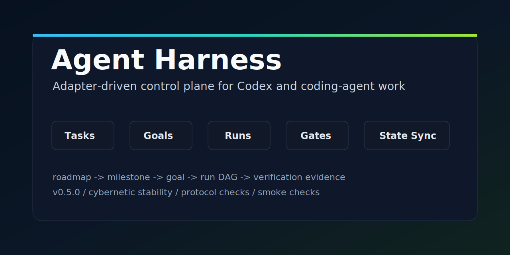

# Agent Harness

[中文](README.zh-CN.md)

[](CHANGELOG.md)
[](plugins/agent-harness/.codex-plugin/plugin.json)
[](scripts/test-suites.mjs)
[](tests/smoke.mjs)
[](LICENSE)

Agent Harness is an adapter-driven control plane for Codex and coding-agent
work. It turns accepted direction into milestones, goals, goal-internal tasks,
runs, worker execution, verification, gates, and state sync.

```text
roadmap -> milestone -> goal -> tasks -> run -> evidence -> state sync
```

[Capability Matrix](docs/HARNESSES.md) · [GitHub Presentation](docs/github-presentation.md) ·
[Changelog](CHANGELOG.md) · [v0.4.0 Release Notes](docs/releases/v0.4.0.md)



## Value Proposition

Agent Harness is for the moment after the human has set direction.

In a normal project, a user may define a roadmap such as `M1` through `M5`,
discuss the product direction for `M5`, and decide that no more product
judgment, credentials, production access, or destructive operation is needed.
At that point, "complete M5" should not mean "write or accept the next small
spec and stop." It should mean:

```text
accepted direction -> milestone completion map -> executable goals / run DAG
-> worker execution -> control-lane verification -> state sync
```

The human should still own direction, authorization, and true gates. Harness
should own the remaining execution mechanics inside the project adapter:

- discover the current roadmap, milestone, spec, goal, task, and run state;
- turn milestone requests such as `complete M5` into explicit milestone items;
- dispatch worker execution when the current thread is acting as main control;
- verify concrete evidence before accepting state;
- keep `tasks`, `status`, goals, runs, and gate records aligned;
- pause only for real human gates such as unclear product direction,
  conflicting constraints, credentials, paid APIs, production access,
  destructive actions, or delivery above policy.

The core promise is not "agents write files." The promise is that a coding
agent can stop losing the plot between roadmap, spec, implementation,
verification, and handoff. Parent milestones stay open until their mapped
subitems are complete; source-spec acceptance such as `M5-S0` cannot silently
become parent milestone completion for `M5`.

## Problem

When one person maintains many software projects, too much time is spent on
coordination work around development: tracking tasks, deciding the next safe
step, preparing goal prompts, checking evidence, and remembering project
boundaries. Agent Harness pushes that work into a stable harness layer so
coding agents can automate more of the development loop and the human spends
less time acting as the task router.

## Adapter Model

Agent Harness is an adapter-driven workflow. The plugin provides the stable
protocol, each project keeps a thin adapter, and project artifacts record the
actual task, spec, goal, run, and gate facts.

The adapter contract is a project execution model, not a single file. It
connects task intake, roadmap direction, milestone planning, specs, goals,
runs, gates, and evidence.

The core principle is:

```text
Plugin defines protocol. Adapter defines overrides. Artifacts record facts.
```


## Design Principles

Agent Harness keeps the control plane small and inspectable:

- Proposal competition is optional and belongs to Shape work. It can compare
  routes and risks, but it does not execute the selected route.
- Accepted state should leave an evidence trail through task entries, specs,
  goals, runs, gate records, command summaries, or review notes.
- Orientation reconciles durable artifacts with newer conversation-confirmed
  state from the active control thread, and reports stale artifacts before
  recommending execution.
- Packaging stays disciplined: docs, skills, templates, marketplace metadata,
  validation commands, and version metadata should describe the same exposed
  behavior.
- Plugin docs and templates stay project-neutral. Local product rules,
  credentials, ports, provider policies, and production procedures belong in
  project adapters and artifacts.
- Route explanations stay lightweight: Codex should briefly say why it is
  orienting, shaping, executing, asking, using a worktree, or staying local.

The runtime/control surfaces, default worker behavior, protocol anchors, and
surface-appropriate verification suites are summarized in the
[Agent Harness capability matrix](docs/HARNESSES.md).

## Influences

Agent Harness is inspired in part by b3ehive's approach to controller-led
agent work: small workflow entry points, explicit route selection, proposal
competition as optional Shape work, inspectable evidence before accepted state,
and disciplined packaging. Agent Harness translates those ideas into its own
fixed/adapter contracts rather than importing b3ehive project structure or
local project policy.

## Artifact Map

Adapter projects use `.harness/config.json` plus a project adapter to
resolve artifact paths. The plugin does not need to know project-specific
product names, database boundaries, production rules, ports, credentials, or
release policy.

Typical adapter artifacts include:

- `Task Index`: the active task/backlog source of truth.
- `Roadmap`: longer-range product or engineering direction.
- `Milestones`: phase-level roadmap outcomes, gates, and deferred registers.
- `Specs`: accepted scope, non-goals, decisions, and validation.
- `Goals`: executable work units with scope, acceptance, and internal tasks.
- `Tasks`: goal-internal checklist or execution breakdown items.
- `Runs / Logs`: one execution attempt, status, prompt, execution DAG,
  subagent guidance, worker node prompts, and evidence.
- `Gate Records`: review, integration, acceptance, and state-sync decisions.

The user-facing terminology line is:

```text
Roadmap -> Milestone -> Goal -> Task -> Run
```

`Goal` is the main Harness work unit. `Task` means a concrete breakdown inside
a Goal. `Run` is an execution attempt and evidence record, not a thread or
session. `P0` / `P1` / `P2` / `P3` are priorities only; `M1` / `M2` / `M5`
refer to roadmap milestones.


## Package Shape

This repo is both a source project and a Codex local marketplace:

- `.agents/plugins/marketplace.json` exposes the local plugin.
- `plugins/agent-harness/` contains the installable Codex plugin.
- `plugins/agent-harness/skills/` contains reusable Codex skills.
- `plugins/agent-harness/references/` contains canonical harness protocols.
- `plugins/agent-harness/schemas/` contains machine-readable contract schemas.
- `plugins/agent-harness/templates/` contains starter templates.
- `plugins/agent-harness/scripts/agent-harness.mjs` provides a small CLI.
- `evals/` contains project-neutral evaluation fixture blueprints.

The current repository's `harness/` and `.harness/` directories are project
adapter state for developing Agent Harness itself. They are not installed as
plugin content. Installed plugin content comes from `plugins/agent-harness/`;
downstream projects get their own adapter artifacts only when `harness:init`
or the CLI initializes/imports that project.

## Plugin Skills

Codex exposes the plugin as `harness`. The primary workflow-controller entry
path is four workflow skills:

- `harness:orient`: read-only project state, current todo, blockers, and next
  route recommendation.
- `harness:init`: initialize a new project, migrate an existing project, run
  doctor/import, and preview activation instructions.
- `harness:intake`: capture and triage a new idea, requirement, bug, or Idea
  Inbox Thread note; record only after explicit approval.
- `harness:execute`: implement a confirmed goal, spec, task breakdown, or run
  packet, then verify and sync task/status/run evidence.

Older artifact-oriented wrapper skills are no longer shipped. Use the workflow
skill that matches the route: `init` for setup/adoption, `orient` for read-only
state, `intake` for new ideas, and `execute` for confirmed work.

Codex plugin metadata does not currently expose a project-confirmed localized
description schema for this package. User-visible plugin and skill descriptions
therefore use a compact zh-CN/en bilingual fallback in the existing description
fields, while runtime responses still follow the user's language.

### Which Skill Should I Use?

| Situation | Skill |
| --- | --- |
| Adopt Agent Harness in a project, migrate an existing task index, run doctor/import, or preview activation. | `harness:init` |
| Check project status, todo, blockers, or next route without editing files. | `harness:orient` |
| Capture or triage a new idea, requirement, bug, or capture-thread note. | `harness:intake` |
| Complete a confirmed goal, spec, task breakdown, or run packet and then verify and sync state. | `harness:execute` |

## Use With A Coding Agent

Most users should start by asking Codex, or another coding agent with access
to the installed plugin, to use the Harness workflow skills in the target
project. The agent should read project instructions, inspect the Harness
adapter, choose a route, and report the evidence it used before changing
state.

Typical prompts look like:

```text
Use harness:init in /path/to/project to adopt Agent Harness. Preview activation and do not edit AGENTS.md without my approval.
Use harness:orient in the current repo and tell me the next safe route.
Use harness:intake to triage this idea without implementing it: Add a new import flow.
Use harness:execute for the confirmed goal in harness/goals/YYYY-MM-DD-task-title.md. Verify and sync task/status evidence.
```

The normal user-level flow is:

```text
harness:init -> harness:orient or harness:intake -> confirmed spec/accepted scope/goal -> harness:execute -> verification -> state sync
```

When you want the current thread to act as main control, gate, reviewer, judge,
or acceptance lane, say so explicitly; Harness treats that as `gate-only` by
default. In `gate-only`, the control thread reviews candidate worker output and
verification evidence, then accepts, blocks, or requests corrections without
directly editing implementation files. Run packets default worker nodes to
`codex-cli-subagent` when that surface is available. Use `implementer` or
`mixed` only when you want the same thread to edit files too.

The CLI remains available as deterministic tooling for agents, operators, and
maintainers, but it is not the primary first-use path for most people. See
the detailed [CLI reference](docs/cli.md) for command examples.

## Acceptance And Validation

Worker output, automation output, inbox notes, and proposal competition results
are candidate evidence until the control lane validates them. Accepted
completion needs concrete evidence such as files changed, command summaries,
run records, gate records, or human review notes. Goals with a
`Spec Acceptance Checklist` must satisfy every checklist item; adapter-required
completion gates must appear under `Required Gate Evidence` with concrete
evidence and `Status: satisfied`.

For documentation or plugin-surface changes in this repository, use:

```bash
git diff --check
npm run test:protocol
npm run test:smoke
npm run validate:plugin
```

Use the [capability matrix](docs/HARNESSES.md) to choose a narrower suite when
only protocol anchors, smoke behavior, eval fixtures, or packaging changed.

For legacy automation that has not adopted suite routing, the minimum local
checks remain:

```bash
git diff --check
npm run test:smoke
npm run validate:plugin
```

Also run goal validation for the active goal; the install docs show the exact
CLI form.

Run `npm run test:eval` only when eval docs or eval fixtures change.

## Workflow

Human steering sets direction. Harness owns the execution engine inside the
adapter boundaries, and it escalates back to a human gate when review,
approval, credentials, production access, or unblocking decisions are needed.


The intended user-level adapter workflow is:

```text
harness:init/import -> harness:orient or harness:intake -> confirmed spec/accepted scope/goal -> harness:execute -> verify -> state sync
```

Under the hood, Harness records route decisions, run packets, acceptance
evidence, delivery state, and status snapshots through deterministic local
tooling. The tooling stays bounded: it does not start Codex, create a daemon,
deploy, or perform delivery steps by itself. Delivery proceeds through the
active goal's Delivery State policy.

Conditional plugin bootstrap remains deferred. The validated plugin manifest
does not declare a session hook, so installed Agent Harness skills do not
inject harness instructions into unrelated projects.

Idea Inbox Threads are capture lanes, not execution lanes. Use
`harness:intake` or `intake idea` to preview and optionally record raw notes;
promote them to specs, goals, or execution only after the control thread
accepts the route.

Proposal competition remains a documented Shape protocol. It may compare
routes, risks, and coverage for ambiguous work, but it does not execute the
selected route and is not an installed `harness:compete` skill in this
package.

## Evaluation And Examples

Project-neutral adoption examples live in
[`docs/examples/downstream-project-shapes.md`](docs/examples/downstream-project-shapes.md).
They cover new adapter projects, existing adapter imports, fixed compatibility
projects, non-harness projects, and messy realistic projects.

The evaluation blueprint lives under [`evals/`](evals/). It defines fixture
shapes, scenario prompts, expected outcomes, and a semi-automatic scoring plan
for agent behavior across project shapes. These fixtures evaluate route
choice, evidence quality, boundary preservation, and state discipline; they do
not require live downstream repositories.

## Install In Codex

During local development, add this repo as a marketplace root:

```bash
codex plugin marketplace add <path-to-agent-harness-repo>
```

After publishing this repo to GitHub, install it on another machine with:

```bash
codex plugin marketplace add <owner>/<repo>
```

Codex will read `.agents/plugins/marketplace.json` and expose the `harness`
plugin.

## Current Design Bias

The current version is `0.4.0`. It adds the project-neutral
[capability matrix](docs/HARNESSES.md), stable `harness-rule:*` protocol
anchors, and `test:protocol` / `test:all` suite routing on top of the
workflow-controller skill surface.

This version is intentionally bounded:

- It creates stable files and directories.
- It gives Codex a consistent way to find project task, spec, goal, and run
  artifacts.
- It recommends worktree behavior, but does not force branch creation.
- It starts with report-only loops before unattended fix loops.
- It makes escalation points explicit before credentials, paid APIs,
  production access, destructive operations, delivery above the active goal
  policy, deploy, or release.

The goal is to increase development automation while keeping the control
points, evidence, and escalation boundaries explicit.

## Roadmap

Future Agent Harness work should make the control contracts usable by other
coding agents, not only Codex. The intended direction is an agent-neutral
adapter layer for task/spec/goal/run packets, capability declarations,
verification results, and state-sync evidence. Support for other coding agents
should be added only after each agent surface has explicit safety boundaries,
result-packet expectations, and validation fixtures.

Delegation should stay capability-driven: detect whether a coding-agent
surface can create isolated work, return an execution result packet, report
changed files and verification, and respect no-daemon / no-push boundaries. If
those capabilities are missing, Agent Harness should fall back to foreground
manual execution instead of pretending parallel or isolated implementation is
available.
