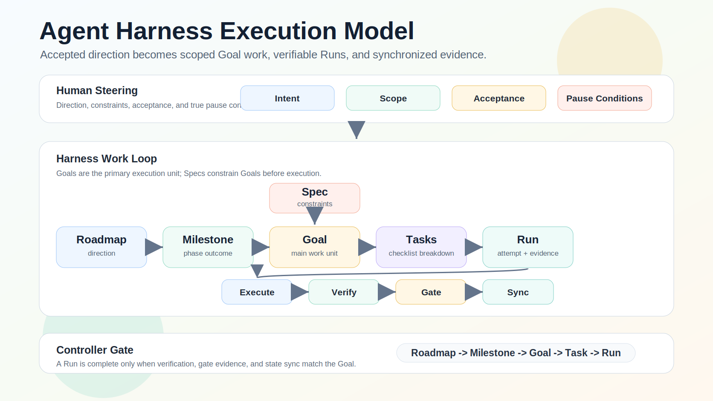
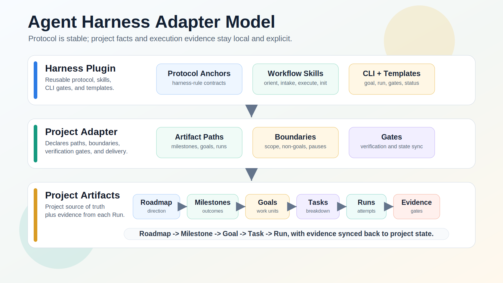

# Agent Harness

[English](README.en.md)

[](CHANGELOG.md)
[](plugins/agent-harness/.codex-plugin/plugin.json)
[](LICENSE)

Agent Harness 是面向 Codex 和 coding agent 的 adapter-driven control plane。
它把已经确认的方向转成边界明确的执行、可验证的 evidence 和同步后的项目状态，
减少人持续充当 task router 的负担。

```text
Roadmap -> Milestone -> Goal -> Task -> Run -> Evidence -> State Sync
```

[快速开始](#在项目中怎么用) · [工作方式](#工作方式) ·
[架构](#架构) · [安全与验收](#安全与验收) · [文档](#文档)

## 在项目中怎么用

### 1. 注册本地 marketplace

从本地 checkout 注册：

```bash
codex plugin marketplace add <path-to-agent-harness-repo>
```

这一步只注册 checkout 中的 marketplace metadata，不安装 plugin。

### 2. 从 Plugins Directory 安装

在 Codex 的 Plugins Directory 中选择 `harness`（marketplace
`agent-harness-local`）并安装。GitHub/远程 marketplace 的注册方式见安装文档。

Codex 会读取 `.agents/plugins/marketplace.json`，并把 plugin 暴露为
`harness`。更新、activation 和项目接入细节见
[Codex 安装说明](docs/install.zh-CN.md)。

### 3. 直接让 Codex 使用 Harness

大多数用户不需要指定 skill，也不需要直接运行 CLI：

```text
用 harness 看当前项目下一步。
用 harness 记录这个想法，先不要实现：增加一个 import flow。
用 harness 执行 harness/goals/YYYY-MM-DD-task-title.md，验证并同步状态。
使用当前 thread 作为 controller，把已接受的 spec 推进到完成；当前目标用 Codex Goal，步骤用 Codex Plan。
```

### 4. 需要时选择明确入口

| 场景 | 公开 skill |
| --- | --- |
| 接入 Harness、导入已有 Goal index、运行 doctor，或预览 activation。 | `harness:init` |
| 只读检查状态、blocker、stale artifact 或下一条 route。 | `harness:orient` |
| 收集或 triage 想法、需求、bug 或 inbox note。 | `harness:intake` |
| 控制 durable work，或在 Codex 完成简单任务后同步已有 Harness 状态。 | `harness:execute` |

普通、明确的 change/build 请求由 Codex 直接执行。澄清 scope、提问和创建 repository Goal
是动作，不是额外 route；proposal competition 仅是显式选择的高级只读技术。

Harness 使用三条执行路径：

- `codex-direct`：普通任务完全交给 Codex，不创建 Harness lifecycle。
- `codex-direct-postflight`：Codex 完成简单任务后，只验证并同步执行前已经存在的 Task、Goal 或 status。
- `durable-harness`：跨 task 恢复、audit、milestone/DAG、multi-worker、persistent state sync 或 high-risk 工作使用 repository Goal/Run。

长时间的 controller 工作优先使用 Codex runtime Goal 保存当前 outcome，用 Codex Plan
维护即时步骤。Harness 不镜像每一次 Plan 更新，只在 durable boundary 或 postflight
closeout 保存项目事实。

## 为什么需要 Agent Harness

Agent Harness 面向“人已经定完方向之后”的阶段。人仍然负责产品判断、授权和真正
需要暂停的条件；Harness 在 project adapter 边界内负责可重复的执行机制：

- 读取 roadmap、milestone、spec、Goal、Task 和 Run 状态；
- 把 `完成 M5` 这样的请求展开成明确的 completion items；
- 准备 Goal 和 execution DAG，而不是写完下一个小 spec 就停下；
- 记录 worker ownership、DAG 和 candidate evidence；调度交给 Codex runtime；
- 在接受 Task/Goal completion 前验证 concrete evidence；
- 把 `State Sync Notes` 作为 Goal 和 Task completion 的组成部分；
- 对齐 Goal index、bounded status snapshot、Goal、Run 和 gate；
- 用 dry-run-first artifact lifecycle 检查/归档 active control state，并只在
  durable evidence 已同步且显式授权时清理 local-only Run；
- 只在方向不清、凭证、付费 API、生产访问、破坏性操作或超出 accepted
  scope 的 external side effect 时暂停并交还给人。

核心承诺不只是“agent 会改文件”，而是 coding agent 不会在 roadmap、spec、
implementation、verification、state sync 和 handoff 之间丢失主线。

## 工作方式



用户可见的层级是：

```text
Roadmap -> Milestone -> Goal -> Task -> Run
```

- **Roadmap** 保存长期方向。
- **Milestone** 是阶段性 outcome，通常包含多个 Goal。
- **Goal** 是带 scope 和 acceptance 的主要 Harness work unit。
- **Task** 是 Goal 内部的 checklist 或 execution item。
- **Run** 是一次 execution attempt 和 evidence record，不等于 thread。
- **Spec** 在执行前约束 Goal，不是 Run 之后才出现的 artifact。

### Spec 与 PRD

Agent Harness 不把 PRD 定义为独立的 protocol concept。Product Requirements
Document 通常说明用户问题、产品价值和预期 outcome；它可以是 Harness Spec 的
一种来源。

`Spec` 是范围更广的 execution term，表示已经确认、足以明确 Goal 边界、约束
和 acceptance conditions 的 scope。PRD 可能已经满足这些要求，也可能需要
technical 或 operational supplement；对于非产品工作，PRD 也可能完全不适用。
因此 Harness 不要求 PRD，也不增加 PRD 专属 path、config、lifecycle state 或
gate。

父级 Milestone 必须等 mapped items 满足后才能关闭。接受 `M5-S0` 这样的
source-spec item，不能在 implementation 尚未完成时静默关闭父级 `M5`。

领域不变量把 durable control 保持在明确边界内：配置路径 containment、
Run/DAG ownership、candidate/accepted evidence、authoritative completion 和
state sync。普通 clear change/build 由 Codex 直接执行；已有简单状态只在完成后做
postflight sync；只有 recovery、audit、milestone/DAG、multi-worker、persistent
state sync 或 high-risk 工作进入 `harness-rule:durable-tier-boundary`。详见
[Capability Matrix](docs/HARNESSES.md)。

## 架构



Agent Harness 把稳定协议与项目事实分开：

```text
Plugin defines protocol. Adapter defines overrides. Artifacts record facts.
```

- **Plugin** 提供 workflow skills、protocol references、schemas、templates
  和 deterministic CLI gates。
- **Project adapter** 声明 artifact paths、边界、verification、state sync、
  work mode 和 external-action policy。
- **Project artifacts** 记录 roadmap、Milestone、Spec、Goal、Task、Run、
  gate result 和 evidence。

Adapter project 通过 `.harness/config.json` 解析 artifact paths；plugin core
不会内置下游项目的产品名、端口、凭证、数据库规则或生产 policy。详细 path
map 见 [Project Contract](docs/project-contract.md#adapter-contract)。

### Adapter 语言策略

Project adapter 通过 machine-readable config 声明语言偏好：

```json
{
  "language": {
    "default": "zh-CN"
  }
}
```

支持值为 `auto`、`en` 和 `zh-CN`。CLI 按以下优先级选择语言：`--lang`、
`AGENT_HARNESS_LANG`、`language.default`、`LC_ALL`、`LC_MESSAGES`、`LANG`；
无法解析的 `auto` 最终 fallback 到英文。

当前边界：该设置只会本地化已经支持的 human-facing CLI messages。
`init`、`goal create` 和 `run prepare` 创建的 deterministic artifacts 仍使用
英文 base templates 与 renderers。Agent 回复应跟随用户语言，同时保持 code、
command、path、API name、skill name、model name 和 Git commit message 的
原始形式。详见[安装文档](docs/install.zh-CN.md#语言策略)与
[Project Contract](docs/project-contract.md#adapter-language-policy)。

### Commentary policy

Project 可以减少重复的过程叙述，同时保留真正重要的信号：

```json
{
  "communication": {
    "commentary": "minimal"
  }
}
```

支持 `minimal`、`balanced` 和 `audit`；未配置时默认使用 `minimal`。该
policy 只约束 Harness skill 与生成的 Run guidance，不会过滤 Codex message，
也不会覆盖 host 强制要求的 tool、safety、approval 或 heartbeat 更新。详见
[Project Contract](docs/project-contract.md#commentary-policy)。

## 安全与验收

Harness 把 worker、automation、inbox 和 proposal output 视为 candidate
evidence，直到 control lane 完成验证。Completion 需要可检查的 evidence，
例如 changed files、command summary、Run record、gate record 或人工 review。

关键边界：

- Controller 是 outcome owner 和 accepted-state owner；只有用户或 Goal 明确要求
  `gate-only` / 只审 evidence 时才禁止 foreground implementation。
- Parallel writer 需要独立锁定的 worktree/cwd，或记录 non-overlap evidence；
  scheduling 和 concurrency 由 Codex runtime 决定。
- Task/Goal 是 accepted-state authority；Run 保存 evidence，status 保持为
  bounded projection。
- `harness-rule:durable-tier-boundary` 让普通 clear change/build 直接使用
  Codex，已有简单状态只做 postflight sync；Harness ceremony 只用于需要持久化控制的工作。
- Status file 是 bounded current-state snapshot，不是 append-only history。
- 执行前要把更新的 conversation-confirmed direction 与 stale artifact 对齐。
- Conditional plugin bootstrap 尚未启用，因此安装 Harness 不会向无关项目
  注入 instructions。

完整 runtime surface、protocol anchors 和 verification suites 见
[Capability Matrix](docs/HARNESSES.md)。

## 仓库与验证

这个仓库同时是 Agent Harness source project 和 Codex local marketplace：

- `.agents/plugins/marketplace.json` 暴露本地 plugin。
- `plugins/agent-harness/` 包含可安装 plugin。
- `plugins/agent-harness/skills/` 包含四个公开 workflow skills。
- `plugins/agent-harness/references/` 包含 canonical protocols。
- `plugins/agent-harness/schemas/` 和 `templates/` 定义项目 contract。
- `plugins/agent-harness/scripts/agent-harness.mjs` 为 agent 和 maintainer
  提供 deterministic CLI operations。
- `evals/` 包含 project-neutral evaluation fixtures。

仓库自身的 `harness/` 和 `.harness/` 是当前项目的开发状态，不会作为 plugin
内容安装。下游项目只会在 adoption 或 import 时得到自己的 adapter artifacts。

README、文档或 plugin surface 发生变化时，运行：

```bash
git diff --check
npm run test:presentation
npm run test:protocol
npm run test:smoke
npm run validate:plugin
```

CLI 是 deterministic tooling，不是大多数用户的首要入口。完整 command
surface 见 [CLI reference](docs/cli.zh-CN.md)。

## 评估

[`evals/`](evals/) 下的 deterministic suite 验证 fixtures 和 trace
contracts；它不会运行模型，也不能证明 GPT-5.6 activation。单独授权的
`npm run test:eval:live` lane 使用 ephemeral read-only Codex execution，
并要求 runtime-reported model evidence。

Project-neutral adoption examples 覆盖新项目、已有 adapter import、
fixed-contract compatibility、非 Harness 项目和 messy realistic state：
[Downstream Project Shapes](docs/examples/downstream-project-shapes.md)。

## 文档

- [使用说明](docs/usage.zh-CN.md)
- [Codex 安装说明](docs/install.zh-CN.md)
- [CLI Reference](docs/cli.zh-CN.md)
- [Capability Matrix](docs/HARNESSES.md)
- [Project Contract](docs/project-contract.md)
- [Cybernetic Stability](docs/cybernetic-stability.md)
- [GitHub Presentation](docs/github-presentation.md)
- [v0.10.0 Release Notes](docs/releases/v0.10.0.md)
- [Changelog](CHANGELOG.md)

Agent Harness 部分受 b3ehive controller-led approach 启发，同时保持自己的
fixed/adapter contracts 和 project-neutral core。

## Roadmap

下一步方向是让其他 coding agent 也能实现同一套 agent-neutral adapter
contract，而不削弱 Harness 边界。只有当新的 execution surface 能声明
isolation、返回 inspectable result packet、报告 verification 和 state-sync
evidence，并遵守 accepted scope 和 external-action boundaries 时，才应该加入。能力不足时，Harness 应
fallback 到 bounded foreground execution，而不是假装具备并行或隔离能力。
