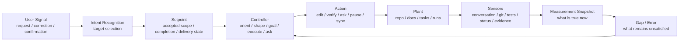

# Cybernetic Stability Model

Agent Harness was not originally designed from cybernetics or control theory.
It grew from practical workflow needs: route selection, accepted scope, goals,
runs, verification, gates, evidence, Delivery State, and state sync.

`harness-rule:cybernetic-stability`: the `0.5.0` design line uses cybernetics as a practical stability model. The
goal is not to expose academic control-theory vocabulary to users. The goal is
to make Harness more stable by strengthening target selection, observation,
gap comparison, feedback quality, and pause behavior.

## Control Loop

Harness can be viewed as a semantic control loop:

```text
intent -> setpoint -> sensor -> measurement -> gap -> controller -> action -> feedback
```



The important change is not the diagram. The important change is the control
question behind every loop:

```text
What target are we controlling toward?
What evidence says the current state is true?
What gap remains?
Did the last action reduce that gap?
Is the feedback strong enough to continue or close?
Has the loop hit a stability or saturation limit?
```

## Harness Mapping

| Cybernetic concept | Harness interpretation |
| --- | --- |
| `setpoint` | Accepted scope, completion conditions, acceptance map, Delivery State, or a research question. |
| `controller` | Current thread route and role: `orient`, `intake`, `shape`, `goal`, `execute`, `ask`, `gate-only`, `mixed`, or `implementer`. |
| `plant` | The project being changed or inspected: repository, docs, Goal index, status file, specs, goals, runs, and adapters. |
| `sensor` | Current conversation, user-confirmed decisions, repo state, `git diff`, tests, CI, status files, run evidence, review comments, and command output. |
| `measurement` | A current-state snapshot: target, observed state, evidence, conflicts, stale artifacts, delivery posture, and user-decision state. |
| `error` / `gap` | The remaining difference between the target and the observed state. |
| `feedback` | Verification result, user response, review result, CI result, state update, or newly discovered conflict. |
| `stability` | The loop keeps moving toward the same accepted target without route oscillation, repeated ineffective actions, or false completion. |
| `saturation` | Context, authority, credentials, budget, risk, external feedback, or delivery policy reaches a limit that requires pause or re-route. |

## Intent As Setpoint Selection

Intent recognition is part of the control loop. If Harness chooses the wrong
target, the rest of the loop can be locally stable while doing the wrong work.

Examples:

- "complete M5" means a `Milestone`, not one source-spec slice such as
  `M5-S0`.
- "what todos remain?" means `orient`, not execution.
- "I want to research this first" means a research target, not immediate spec
  implementation.
- "this task" needs normalization to `Goal` or goal-internal `Task` before
  route selection.

The control loop therefore starts with:

```text
raw user signal -> intent recognition -> setpoint selection -> route decision
```

## Sensor Freshness

`sensor freshness` is a first-class stability concern. Harness already reads many sources. The stability problem is that those
sources are not equally fresh or authoritative.

Default precedence:

1. Newer explicit user instruction or confirmation.
2. Current local observations such as `git status`, `git diff`, command output,
   and freshly run tests.
3. Accepted specs, goals, runs, and gate records that still match the current
   target.
4. Status and Goal indexes, unless they conflict with newer conversation or
   local evidence.
5. Historical run logs and old summaries, which are context until their
   evidence is revalidated.

When sources conflict, Harness should report the conflict as route evidence
instead of silently choosing the older artifact.

## Measurement Snapshot

A measurement snapshot is the compact current-state judgment produced after
reading the relevant sensors. It is not a new mandatory file in the first
version; it is a required reasoning shape for orientation, goal/run handoff,
and closeout.

Useful fields:

```text
Target:
Observed state:
Evidence:
Conflicts / stale artifacts:
Delivery state:
User-decision state:
Remaining gap:
Stable next action:
```

This snapshot makes handoff safer because a future thread can recover the same
state judgment instead of reinterpreting the entire repository from scratch.

## Gap And Feedback Quality

For non-trivial work, Harness should be able to say what gap was closed and
what gap remains.

Strong feedback usually includes:

- passing deterministic tests relevant to the change;
- fresh command output;
- concrete changed files;
- accepted gate evidence;
- explicit user confirmation when the target requires human judgment.

Weak or insufficient feedback includes:

- agent narrative without files or commands;
- stale status files;
- historical run logs without fresh validation;
- pending CI treated as passing CI;
- tests that do not cover the changed behavior;
- screenshots or manual observations that do not inspect the relevant state.

If feedback is weak, the stable action is to verify, re-orient, or pause. It is
not to claim completion.

## Stability And Saturation

The loop is unstable when it keeps acting without reducing the remaining gap.
Common Harness symptoms:

- route oscillation between `shape`, `goal`, `execute`, and `ask`;
- repeated verification that does not test the relevant behavior;
- stale artifacts overriding newer user intent;
- local implementation being described as shipped or released;
- parent milestones being closed after only a leaf item;
- repeated broad confirmation questions after `Need user: None` is already
  true.

The loop is saturated when the controller has reached a real limit:

- context is too large to preserve the target and evidence;
- current role lacks authority to edit, commit, push, deploy, or release;
- credentials, paid APIs, production access, or destructive approval are
  needed;
- external feedback such as CI, review, or user validation is delayed;
- risk or cost exceeds the accepted scope.

Saturation should trigger pause or re-route, not guessing.

## Candidate Rule Line

The `0.5.0` line treats these as the practical rule candidates:

- `harness-rule:intent-setpoint-selection`
- `harness-rule:sensor-freshness`
- `harness-rule:measurement-snapshot`
- `harness-rule:remaining-gap`
- `harness-rule:feedback-quality`
- `harness-rule:stability-saturation`

The product shorthand for the last group is `stability/saturation`: pause or
re-route when the loop is no longer reducing the gap or when context,
authority, credentials, cost, risk, or external feedback reaches a real limit.

These rule names are now protocol anchors. The product requirement is stable:
Harness should make the target, observation, remaining gap, feedback quality,
and pause reason explicit enough that the loop can be resumed and audited.

## Version Boundary

`0.4.0` made the public protocol surface easier to inspect with a capability
matrix, stable rule anchors, and suite routing.

`0.5.0` is the cybernetic stability line. It upgrades the design bias from
"route and verify the accepted work" to "control toward an explicit target
using fresh observations, gap reduction, feedback quality, and saturation
checks."

This line does not require daemons, watchers, background automation, telemetry,
paid services, production access, or release automation.
